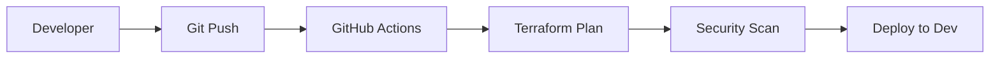
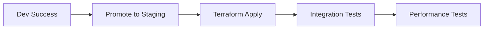
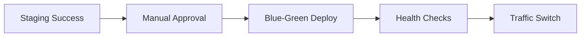

# 🏗️ Arquitetura do Projeto VM

## 📋 Visão Geral

O Projeto VM implementa uma arquitetura multicloud escalável e resiliente, seguindo as melhores práticas de DevOps e infraestrutura como código (IaC).

## 🎯 Objetivos da Arquitetura

- **Escalabilidade**: Suporte a múltiplos ambientes e crescimento horizontal
- **Resiliência**: Alta disponibilidade e recuperação de desastres
- **Segurança**: Implementação de segurança em camadas
- **Observabilidade**: Monitoramento completo e logs centralizados
- **Automação**: CI/CD pipeline completo e automação de infraestrutura

## 🏛️ Arquitetura de Alto Nível

```
┌─────────────────────────────────────────────────────────────────┐
│                        CI/CD PIPELINE                          │
│                    GitHub Actions + ArgoCD                     │
└─────────────────────────────────────────────────────────────────┘
                                │
                                ▼
┌─────────────────────────────────────────────────────────────────┐
│                    TERRAFORM CLOUD                             │
│                State Management & Remote Backend               │
└─────────────────────────────────────────────────────────────────┘
                                │
                                ▼
┌─────────────────────────────────────────────────────────────────┐
│                    MULTICLOUD INFRASTRUCTURE                   │
│                                                                 │
│  ┌─────────────┐    ┌─────────────┐    ┌─────────────┐        │
│  │     AWS     │    │    AZURE    │    │     GCP     │        │
│  │             │    │             │    │             │        │
│  │ ┌─────────┐ │    │ ┌─────────┐ │    │ ┌─────────┐ │        │
│  │ │  VPC    │ │    │ │  VNet   │ │    │ │  VPC    │ │        │
│  │ │  EC2    │ │    │ │   VM    │ │    │ │  GCE    │ │        │
│  │ │  RDS    │ │    │ │ SQL DB  │ │    │ │Cloud SQL│ │        │
│  │ │  ALB    │ │    │ │  AKS    │ │    │ │  GKE    │ │        │
│  │ └─────────┘ │    │ └─────────┘ │    │ └─────────┘ │        │
│  └─────────────┘    └─────────────┘    └─────────────┘        │
└─────────────────────────────────────────────────────────────────┘
                                │
                                ▼
┌─────────────────────────────────────────────────────────────────┐
│                    MONITORING & OBSERVABILITY                  │
│                                                                 │
│  ┌─────────────┐    ┌─────────────┐    ┌─────────────┐        │
│  │ CloudWatch  │    │Azure Monitor│    │Stackdriver  │        │
│  │   Logs      │    │   Logs      │    │   Logs      │        │
│  └─────────────┘    └─────────────┘    └─────────────┘        │
│                                                                 │
│  ┌─────────────┐    ┌─────────────┐    ┌─────────────┐        │
│  │ Prometheus  │    │   Grafana   │    │   Jaeger    │        │
│  │  Metrics    │    │  Dashboards │    │   Tracing   │        │
│  └─────────────┘    └─────────────┘    └─────────────┘        │
└─────────────────────────────────────────────────────────────────┘
```

## 🔧 Componentes da Infraestrutura

### 1. **Rede (Network)**

#### AWS
- **VPC**: Rede virtual privada com subnets públicas e privadas
- **Internet Gateway**: Conectividade com a internet
- **NAT Gateway**: Conectividade de saída para instâncias privadas
- **Route Tables**: Configuração de roteamento
- **Security Groups**: Controle de tráfego de rede

#### Azure
- **Virtual Network**: Rede virtual com subnets
- **Network Security Groups**: Controle de tráfego
- **Load Balancer**: Balanceamento de carga
- **Application Gateway**: Gateway de aplicação

#### GCP
- **VPC**: Rede virtual com subnets
- **Firewall Rules**: Regras de firewall
- **Load Balancer**: Balanceamento de carga
- **Cloud Router**: Roteamento de rede

### 2. **Computação (Compute)**

#### AWS
- **EC2 Instances**: Instâncias virtuais
- **Auto Scaling Groups**: Escalabilidade automática
- **Launch Templates**: Templates de lançamento
- **User Data**: Scripts de inicialização

#### Azure
- **Virtual Machines**: Máquinas virtuais
- **Virtual Machine Scale Sets**: Conjuntos de escalabilidade
- **Container Instances**: Instâncias de container
- **AKS**: Kubernetes gerenciado

#### GCP
- **Compute Engine**: Instâncias de computação
- **GKE**: Kubernetes gerenciado
- **Cloud Run**: Containers serverless
- **App Engine**: Plataforma de aplicação

### 3. **Armazenamento (Storage)**

#### AWS
- **S3**: Armazenamento de objetos
- **EBS**: Volumes de bloco
- **EFS**: Sistema de arquivos
- **RDS**: Banco de dados relacional

#### Azure
- **Blob Storage**: Armazenamento de objetos
- **Managed Disks**: Discos gerenciados
- **File Shares**: Compartilhamentos de arquivo
- **SQL Database**: Banco de dados SQL

#### GCP
- **Cloud Storage**: Armazenamento de objetos
- **Persistent Disks**: Discos persistentes
- **Cloud SQL**: Banco de dados SQL
- **Firestore**: Banco de dados NoSQL

### 4. **Segurança (Security)**

#### Controles de Acesso
- **IAM/RBAC**: Controle de acesso baseado em identidade
- **Service Accounts**: Contas de serviço
- **Policies**: Políticas de acesso

#### Criptografia
- **Encryption at Rest**: Criptografia em repouso
- **Encryption in Transit**: Criptografia em trânsito
- **Key Management**: Gerenciamento de chaves

#### Monitoramento de Segurança
- **CloudTrail**: Auditoria de API
- **Security Center**: Centro de segurança
- **VPC Flow Logs**: Logs de fluxo de rede

### 5. **Monitoramento (Monitoring)**

#### Métricas
- **CloudWatch**: Métricas da AWS
- **Azure Monitor**: Métricas do Azure
- **Stackdriver**: Métricas do GCP
- **Prometheus**: Métricas customizadas

#### Logs
- **CloudWatch Logs**: Logs da AWS
- **Log Analytics**: Logs do Azure
- **Cloud Logging**: Logs do GCP
- **ELK Stack**: Stack de logs

#### Alertas
- **SNS**: Notificações da AWS
- **Action Groups**: Grupos de ação do Azure
- **Pub/Sub**: Publicação/Subscrição do GCP
- **PagerDuty**: Integração com PagerDuty

## 🔄 Fluxo de Deploy

### 1. **Desenvolvimento**


### 2. **Staging**


### 3. **Produção**


## 🛡️ Estratégias de Segurança

### 1. **Defesa em Profundidade**
- **Camada 1**: Segurança de rede (VPC, Security Groups)
- **Camada 2**: Segurança de aplicação (WAF, DDoS Protection)
- **Camada 3**: Segurança de dados (Encryption, Access Control)
- **Camada 4**: Monitoramento (Logs, Alerts)

### 2. **Princípio do Menor Privilégio**
- **IAM Policies**: Políticas mínimas necessárias
- **Service Accounts**: Contas específicas por serviço
- **Network Policies**: Acesso de rede restrito

### 3. **Compliance**
- **SOC 2**: Controles de segurança
- **ISO 27001**: Gestão de segurança da informação
- **GDPR**: Proteção de dados pessoais
- **PCI DSS**: Segurança de dados de cartão

## 📊 Métricas e KPIs

### 1. **Disponibilidade**
- **Uptime**: > 99.9%
- **MTTR**: < 1 hora
- **MTBF**: > 720 horas

### 2. **Performance**
- **Response Time**: < 200ms
- **Throughput**: > 1000 req/s
- **Error Rate**: < 0.1%

### 3. **Segurança**
- **Vulnerability Scan**: Semanais
- **Penetration Test**: Trimestrais
- **Security Incidents**: 0

### 4. **Custos**
- **Cost Optimization**: Redução de 20% anual
- **Budget Alerts**: 80% do orçamento
- **Resource Utilization**: > 70%

## 🔮 Roadmap de Evolução

### **Fase 1 (Atual)**
- ✅ Infraestrutura como Código
- ✅ CI/CD Pipeline
- ✅ Monitoramento básico
- ✅ Segurança básica

### **Fase 2 (Próxima)**
- 🔄 Containerização
- 🔄 Kubernetes
- 🔄 Service Mesh
- 🔄 Auto-scaling

### **Fase 3 (Futura)**
- 📋 Observabilidade avançada
- 📋 Machine Learning
- 📋 Serverless
- 📋 Edge Computing

### **Fase 4 (Longo Prazo)**
- 🚀 Multi-region
- 🚀 Disaster Recovery
- 🚀 Zero Trust
- 🚀 AI/ML Operations

## 📚 Referências

- [AWS Well-Architected Framework](https://aws.amazon.com/architecture/well-architected/)
- [Azure Architecture Center](https://docs.microsoft.com/en-us/azure/architecture/)
- [Google Cloud Architecture Framework](https://cloud.google.com/architecture/framework)
- [Terraform Best Practices](https://www.terraform.io/docs/cloud/guides/recommended-practices/index.html)
- [DevOps Handbook](https://itrevolution.com/the-devops-handbook/)

# Deploy da observabilidade
cd terraform/aws
terraform apply -target=module.monitoring
terraform apply -target=module.logging
terraform apply -target=module.tracing

# Acessar dashboards
kubectl port-forward svc/grafana-service 3000:80 -n monitoring
kubectl port-forward svc/kibana-kibana 5601:5601 -n logging
kubectl port-forward svc/jaeger-query 16686:16686 -n tracing

# Rollback manual
helm rollback projeto-vm-app 1 --namespace dev

# Rollback inteligente
python scripts/intelligent_rollback.py --once --namespaces dev

# Verificar status
kubectl rollout status deployment/projeto-vm-app -n dev 